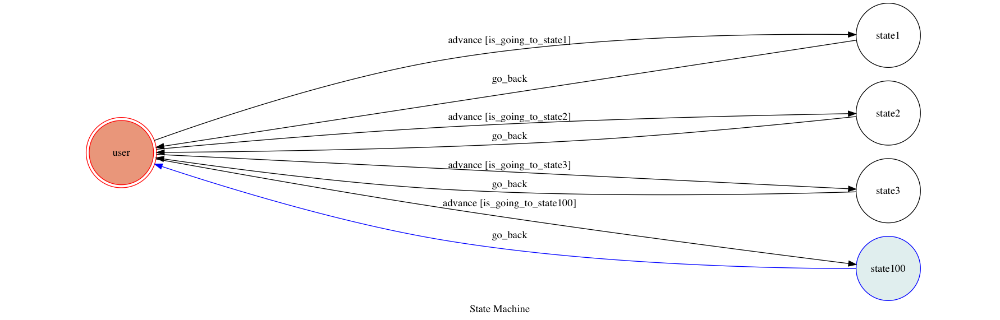

# myBot

A telegram bot based on a finite state machine

## Setup

### Prerequisite
* Python 3

#### Install Dependency
```sh
pip install -r requirements.txt
```

* pygraphviz (For visualizing Finite State Machine)
    * [Setup pygraphviz on Ubuntu](http://www.jianshu.com/p/a3da7ecc5303)

### Secret Data

`API_TOKEN` and `WEBHOOK_URL` in app.py **MUST** be set to proper values.
Otherwise, you might not be able to run your code.

### Run Locally
You can either setup https server or using `ngrok` as a proxy.

**`ngrok` would be used in the following instruction**

```sh
ngrok http 5000
```

After that, `ngrok` would generate a https URL.

You should set `WEBHOOK_URL` (in app.py) to `your-https-URL/hook`.

#### Run the sever

```sh
python3 app.py
```

## Finite State Machine


## Usage
The initial state is set to `user`.

Every time `user` state is triggered to `advance` to another state, it will `go_back` to `user` state after the bot replies corresponding message. Then the bot will say `This is TOC Hotel! What can I do for you?` when entering `user` state.

* user
	* Input: "check in"
		* Reply: "ok, your ID please!"

	* Input: "check out"
		* Reply: "Thank you for choosing TOC Hotel!"

    * Input: "wifi password"
		* Reply: "wificsie"

    * Input: "hotel photo"
		* Reply: an image of a hotel


## Author
[anakinanakin](https://github.com/anakinanakin)
